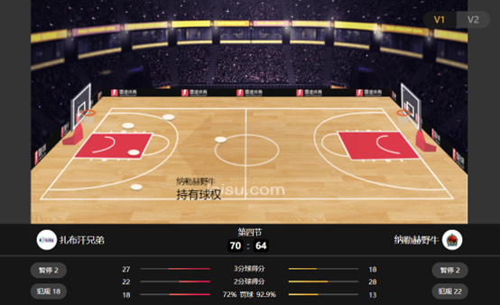

# 面向对象分析与设计课程设计说明

## 一、 课设内容

以“体育赛事直播可视化”为题，利用面向对象分析与设计方法，建立体育赛事直播可视化系统的UML模型（含用例模型、静态模型和动态模型等），并实现该系统。

## 二、	课设要求
- 可多人组成一个小组共同完成课设，每组至多两人；鼓励单人独立完成课设；
- 禁止抄袭他人作业、以及从网络下载他人程序作为成果提交；抄袭者或将作业提供给他人抄袭的，平时成绩均以零分计算；
- 撰写分析设计报告，格式自拟；
- 可采用任意的UML软件和编程语言；
- 该系统可实现为Web程序、APP、微信小程序或桌面应用程序。
- 将分析设计报告和程序源代码打包一起提交，以“学号_姓名_OOAD_2025”的格式命名打包文件，并通过电子邮件发送到cmcsfzu2012@126.com；
- 同组只需交一份，但需要说明各人负责的内容；
- 课设提交的截止时间为：2026年1月18日

## 三、	需求说明

体育赛事直播可视化系统面向篮球赛事，以图形化、动画的形式为用户提供可视化的赛事直播服务。

图-1 体育赛事直播可视化系统参考界面

系统接收以文字记录的比赛事件流（见附件），通过解析事件流识别出赛场上的事件和进程，转化为动画形式呈现给用户。（补充说明：可将比赛事件流存储在文件中，系统通过读取该文件模拟接收比赛信息；若能通过网络实时获取比赛进程信息更好）

系统主界面上应该显示比赛双方的球队名称、球队图标、当前时间、各队得分以及各队的技术统计，包括但不限于2分球得分、3分球得分、犯规数、盖帽数、篮板数等，界面可参考[图-1](docs/imgs/效果.png)。主队位于界面左侧、客队位于界面右侧。

比赛中的事件，如球权转换、犯规、2分进球、3分进球、罚球、盖帽、球出界等都应以图形或动画呈现。系统应支持扩展新的比赛事件可视化，如投篮不中。

系统应统计每位球员的技术数据，以便用户查看，如[图-2](docs/imgs/图片2.png)所示。

系统应能支持用户切换观看其它比赛。

系统免费提供给用户使用，不需要用户事先注册、登录。

## 四. 附件

## 四. 附件

[见附件](docs/附件.md)