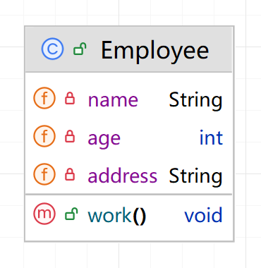
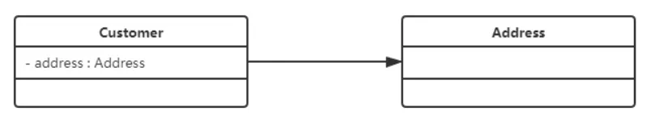
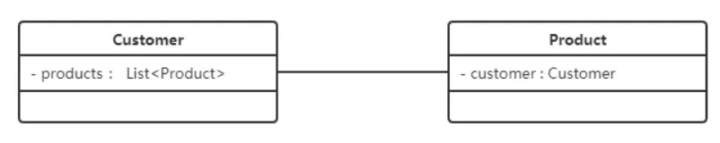
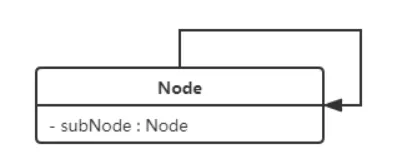
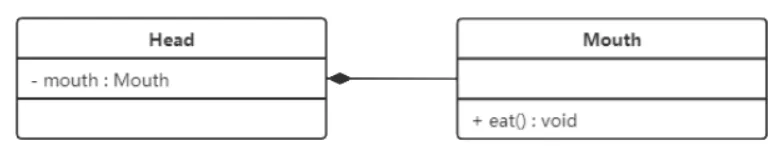
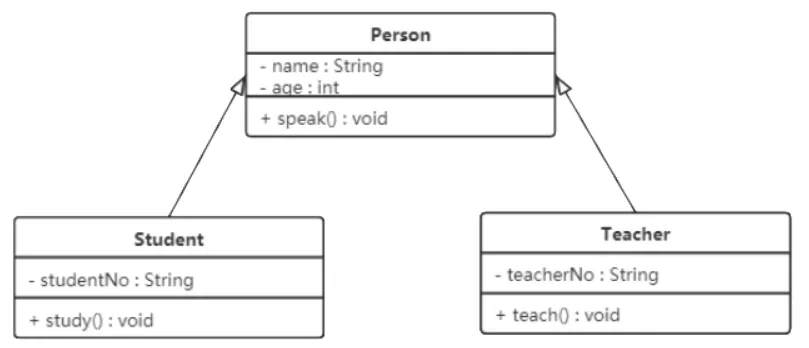
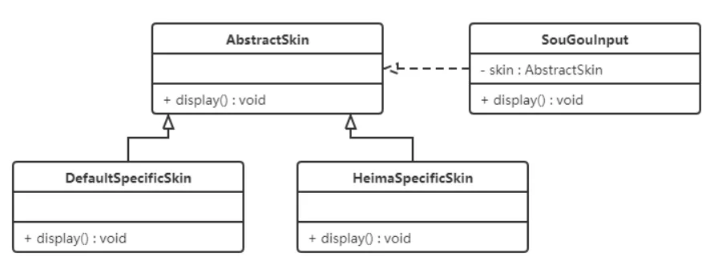

# 设计模式考试资源

## 目录

## 1. 设计模式概述(节选自[蓝染-惣右介](https://developer.aliyun.com/article/1646583))

### 1、软件设计模式的产生背景

"设计模式"最初并不是出现在软件设计中，而是被用于建筑领域的设计中。
1977年美国著名建筑大师、加利福尼亚大学伯克利分校环境结构中心主任克里斯托夫·亚历山大（Christopher
Alexander）在他的著作《建筑模式语言：城镇、建筑、构造》中描述了一些常见的建筑设计问题，并提出了 253
种关于对城镇、邻里、住宅、花园和房间等进行设计的基本模式。
1990年软件工程界开始研讨设计模式的话题，后来召开了多次关于设计模式的研讨会。直到1995 年，艾瑞克·伽马（ErichGamma）、理査德·海尔姆（Richard
Helm）、拉尔夫·约翰森（Ralph Johnson）、约翰·威利斯迪斯（John Vlissides）等 4 位作者合作出版了《设计模式：可复用面向对象软件的基础》一书，在此书中收录了
23 个设计模式，这是设计模式领域里程碑的事件，导致了软件设计模式的突破。这 4 位作者在软件开发领域里也以他们的“四人组”（Gang
of Four，GoF）著称。

### 2、软件设计模式的概念

软件设计模式（Software Design
Pattern），又称设计模式，是一套被反复使用、多数人知晓的、经过分类编目的、代码设计经验的总结。它描述了在软件设计过程中的一些不断重复发生的问题，以及该问题的解决方案。也就是说，它是解决特定问题的一系列套路，是前辈们的代码设计经验的总结，具有一定的普遍性，可以反复使用。

### 3、学习设计模式的必要性

阿巴阿巴阿巴阿巴阿巴阿巴

### 4、设计模式分类

- **创建型模式**
  用于描述“怎样创建对象”，它的主要特点是“将对象的创建与使用分离”。GoF（四人组）书中提供了单例、原型、工厂方法、抽象工厂、建造者等
  5 种创建型模式。
- **结构型模式**
  用于描述如何将类或对象按某种布局组成更大的结构，GoF（四人组）书中提供了代理、适配器、桥接、装饰、外观、享元、组合等 7 种结构型模式。
- **行为型模式**
  用于描述类或对象之间怎样相互协作共同完成单个对象无法单独完成的任务，以及怎样分配职责。GoF（四人组）书中提供了模板方法、策略、命令、职责链、状态、观察者、中介者、迭代器、访问者、备忘录、解释器等
  11 种行为型模式。

## 2. UML图(节选自[蓝染-惣右介](https://developer.aliyun.com/article/1646583))

统一建模语言（Unified Modeling Language，UML）是用来设计软件的可视化建模语言。它的特点是简单、统一、图形化、能表达软件设计中的动态与静态信息。
UML 从目标系统的不同角度出发，定义了用例图、类图、对象图、状态图、活动图、时序图、协作图、构件图、部署图等 9 种图。

### 1、类图概述

类图(Class diagram)是显示了模型的静态结构，特别是模型中存在的类、类的内部结构以及它们与其他类的关系等。类图不显示暂时性的信息。类图是面向对象建模的主要组成部分。

### 2、类图的作用

- 在软件工程中，类图是一种静态的结构图，描述了系统的类的集合，类的属性和类之间的关系，可以简化了人们对系统的理解；
- 类图是系统分析和设计阶段的重要产物，是系统编码和测试的重要模型。

### 3、类图表示法

#### (1)类的表示方式

在UML类图中，类使用包含类名、属性(field) 和方法(method)
且带有分割线的矩形来表示，比如下图表示一个Employee类，它包含name,age和address这3个属性，以及work()方法。



属性/方法名称前加的加号和减号表示了这个属性/方法的可见性，UML类图中表示可见性的符号有三种：

- `+`：表示public
- `-`：表示private
- `#`：表示protected

属性的完整表示方式是： `可见性 名称 : 类型 [ = 缺省值]`

方法的完整表示方式是： `可见性 名称(参数列表) [ : 返回类型]`

**注意：**

1. 中括号中的内容表示是可选的
2. 也有将类型放在变量名前面，返回值类型放在方法名前面

#### (2)类与类之间关系的表示方式

##### 1. 关联关系

关联关系是对象之间的一种引用关系，用于表示一类对象与另一类对象之间的联系，如老师和学生、师傅和徒弟、丈夫和妻子等。关联关系是类与类之间最常用的一种关系，分为一般关联关系、聚合关系和组合关系。我们先介绍一般关联。
关联又可以分为

1. 单向关联

   
2. 双向关联

   
3. 自关联

   

##### 2. 聚合关系

聚合关系是关联关系的一种，是**强关联关系**，是整体和部分之间的关系。
聚合关系也是通过成员对象来实现的，其中成员对象是整体对象的一部分，但是**成员对象可以脱离整体对象而独立存在**。

例如，学校与老师的关系，学校包含老师，但如果学校停办了，老师依然存在。
在 UML 类图中，聚合关系可以用带空心菱形的实线来表示，菱形指向整体。下图所示是大学和教师的关系图


##### 3. 组合关系

组合表示类之间的整体与部分的关系，但它是一种更强烈的聚合关系。
在组合关系中，整体对象可以控制部分对象的生命周期，一旦整体对象不存在，部分对象也将不存在，**部分对象不能脱离整体对象而存在
**。

例如，头和嘴的关系，没有了头，嘴也就不存在了。
在 UML 类图中，组合关系用带实心菱形的实线来表示，菱形指向整体。下图所示是头和嘴的关系图：



##### 4. 依赖关系

依赖关系是一种使用关系，它是对象之间耦合度最弱的一种关联方式，是临时性的关联。

在代码中，某个类的方法通过局部变量、方法的参数或者对静态方法的调用来访问另一个类（被依赖类）中的某些方法来完成一些职责。

在 UML 类图中，依赖关系使用带箭头的虚线来表示，箭头从使用类指向被依赖的类。下图所示是司机和汽车的关系图，司机驾驶汽车：


##### 5. 继承关系

继承关系（泛化关系）是对象之间耦合度最大的一种关系，表示一般与特殊的关系，是**父类与子类之间的关系**，是一种继承关系。

在 UML 类图中，泛化关系用带空心三角箭头的实线来表示，箭头从子类指向父类。在代码实现时，使用面向对象的继承机制来实现泛化关系。例如，Student
类和 Teacher 类都是 Person 类的子类，其类图如下图所示：



##### 6. 实现关系

实现关系是接口与实现类之间的关系。在这种关系中，类实现了接口，类中的操作实现了接口中所声明的所有的抽象操作。

在 UML 类图中，实现关系使用带空心三角箭头的虚线来表示，箭头从实现类指向接口。例如，汽车和船实现了交通工具，其类图如图所示。


## 3. 软件设计原则(节选自[蓝染-惣右介](https://developer.aliyun.com/article/1646583))

### 1. 开闭原则

**对扩展开放，对修改关闭**。

在程序需要进行拓展的时候，不能去修改原有的代码，实现一个热插拔的效果。简言之，是为了使程序的扩展性好，易于维护和升级。

想要达到这样的效果，我们需要使用接口和抽象类。
因为抽象灵活性好，适应性广，只要抽象的合理，可以基本保持软件架构的稳定。而软件中易变的细节可以从抽象派生来的实现类来进行扩展，当软件需要发生变化时，只需要根据需求重新派生一个实现类来扩展就可以了。

下面以 搜狗输入法 的皮肤为例介绍开闭原则的应用。

【例】搜狗输入法 的皮肤设计。

分析：搜狗输入法 的皮肤是输入法背景图片、窗口颜色和声音等元素的组合。用户可以根据自己的喜爱更换自己的输入法的皮肤，也可以从网上下载新的皮肤。这些皮肤有共同的特点，可以为其定义一个抽象类（
`AbstractSkin`），而每个具体的皮肤（`DefaultSpecificSkin`和`HeimaSpecificSkin`
）是其子类。用户窗体可以根据需要选择或者增加新的主题，而不需要修改原代码，所以它是满足开闭原则的。



### 2. 李氏替换原则

**子类必须能够替换其父类，并且不会影响程序的正确性。**

举个栗子

```java
class JavaBackendEngineer {
    public void writeCode() {
        System.out.println("编写Java代码...");
    }
}

class PythonBackendEngineer extends JavaBackendEngineer {
    @Override
    public void writeCode() {
        throw new RuntimeException("我他妈的不会Java...");
    }
}

class Client {
    public static void writeCode(JavaBackendEngineer engineer) {
        engineer.writeCode();
    }

    public static void main(String[] args) {
        JavaBackendEngineer javaEngineer = new JavaBackendEngineer();
        PythonBackendEngineer pythonEngineer = new PythonBackendEngineer();
        // 正常
        writeCode(javaEngineer);
        // 炸了，我不会Java
        writeCode(pythonEngineer);
    }
}
```

在上面栗子中，`PythonBackendEngineer` 继承了 `JavaBackendEngineer`，但是它的 `writeCode()` 方法抛出了一个运行时异常。如果将
`JavaBackendEngineer` 换成 `PythonBackendEngineer`，直接抛异常。违反了里氏替换原则。

应做出如下修改，尽量面向接口编程：

```java
interface Engineer {
    void writeCode();
}

class JavaBackendEngineer implements Engineer {
    @Override
    public void writeCode() {
        System.out.println("编写Java代码...");
    }
}

class PythonBackendEngineer implements Engineer {
    @Override
    public void writeCode() {
        System.out.println("编写Python代码...");
    }
}

class Client {
    public static void writeCode(Engineer engineer) {
        engineer.writeCode();
    }

    public static void main() {
        JavaBackendEngineer javaEngineer = new JavaBackendEngineer();
        PythonBackendEngineer pythonEngineer = new PythonBackendEngineer();
        // 这下两位工程师都可以写代码了
        writeCode(javaEngineer);
        writeCode(pythonEngineer);
    }
}
```

### 3. 依赖倒置原则

**高层模块不应该依赖低层模块，二者都应该依赖其抽象；抽象不应该依赖细节，细节应该依赖抽象**。

举个栗子：

```java
class AliPay {
    public void pay() {
        System.out.println("支付宝支付");
    }
}

class Client {
    public static void main() {
        AliPay alipay = new AliPay();
        alipay.pay();
    }
}
```

如果要新增一个微信支付，则需要修改 `Client` 类，违反了依赖倒置原则。

应做出如下修改：

```java
interface Payment {
    void pay();
}

class AliPay implements Payment {
    @Override
    public void pay() {
        System.out.println("支付宝支付");
    }
}

class WechatPay implements Payment {
    @Override
    public void pay() {
        System.out.println("微信支付");
    }
}

class Client {
    public static void main() {
        Payment payment = new AliPay();
        payment.pay();
    }
}
```

1. `Client` 类不再依赖 `AliPay` 类，而是依赖 `Payment` 接口。
2. `AliPay` 类和 `WechatPay` 类都实现了 `Payment` 接口，所以它们都可以作为 `Client` 类的参数。
3. `Client` 类只需要知道 `Payment` 接口，而不知道具体的支付方式，这样就实现了依赖倒置原则。

### 4. 接口隔离原则

**使用多个专门的接口，而不使用单一的总接口**。

举个栗子：

```java
interface EngineerTechnologyStack {
    void springBoot();

    void java();

    void mysql();

    void html();

    void css();

    void javascript();
}
```

如果有一个后端工程师`BackendEngineer`实现了`EngineerTechnologyStack`接口，但是他只用到了`java`、`mysql`、`springBoot`，而没有用到
`html`、`css`和`javascript`，这违反了接口隔离原则。

应做出如下修改：

1. 定义多个接口`BackendTechnologyStack`和`FrontendTechnologyStack`
2. `BackendEngineer`和`FrontendEngineer`分别实现`BackendTechnologyStack`和`FrontendTechnologyStack`接口
3. `Client`类只依赖`BackendTechnologyStack`接口，而不依赖`FrontendTechnologyStack`接口。

```java
interface BackendTechnologyStack {
    void java();

    void mysql();

    void springBoot();
}

interface FrontendTechnologyStack {
    void html();

    void css();

    void javascript();
}

class BackendEngineer implements BackendTechnologyStack {
    @Override
    public void java() {
        System.out.println("Java工程师");
    }

    @Override
    public void mysql() {
        System.out.println("MySQL工程师");
    }

    @Override
    public void springBoot() {
        System.out.println("SpringBoot工程师");
    }
}

class FrontendEngineer implements FrontendTechnologyStack {
    @Override
    public void html() {
        System.out.println("HTML工程师");
    }

    @Override
    public void css() {
        System.out.println("CSS工程师");
    }

    @Override
    public void javascript() {
        System.out.println("JavaScript工程师");
    }
}

class Client {
    public static void main() {
        BackendEngineer backendEngineer = new BackendEngineer();
        backendEngineer.java();
        backendEngineer.mysql();
        backendEngineer.springBoot();
    }
}
```

### 5. 迪米特法则

**如果两个类不必彼此直接通信，那么这两个类就不应当发生直接的相互作用。如果其中的一个类需要调用另一个类的某一个方法的话，可以通过第三者转发这个调用。
**

举个栗子：

```java
// 员工类
class Employee {
    public int getEmployeeCount() {
        return 10086;
    }
}

// 小组领导类
class GroupLeader {
    public int getGroupLeaderCount() {
        return 8848;
    }
}

// 部门经理类
class DepartmentManager {
    public int countEmployee(GroupLeader groupLeader) {
        Employee employee = new Employee();
        return groupLeader.getGroupLeaderCount() + employee.getEmployeeCount();
    }
}
```

`DepartmentManager` 类依赖 `GroupLeader` 类，根据迪米特法则。`DepartmentManager`应当只与 `GroupLeader` 类通信，而不与
`Employee` 类通信。

应做出如下修改：

```java
// 员工类
class Employee {
    public int getEmployeeCount() {
        return 10086;
    }
}

// 小组领导类
class GroupLeader {
    public int getGroupLeaderCount() {
        return 8848;
    }

    public int countEmployee(Employee employee) {
        return employee.getEmployeeCount() + getGroupLeaderCount();
    }
}

// 部门经理类
class DepartmentManager {
    public int countEmployee(GroupLeader groupLeader) {
        return groupLeader.countEmployee();
    }
}
```

这样，`DepartmentManager` 类只与 `GroupLeader` 类通信，而不与 `Employee` 类通信。

### 6. 单一职责原则

**一个类只负责一项职责**。

举个栗子：

```java
class CacheUtil {
    public void cacheHotBill() {
        System.out.println("缓存热门账单...");
    }

    public void cacheBill() {
        System.out.println("缓存账单...");
    }

    public void cacheBillList() {
        System.out.println("缓存账单列表...");
    }

    public void cacheHotBillList() {
        System.out.println("缓存热门账单列表...");
    }
}
```

以上是我曾经在[某个项目](https://github.com/murphy-955/db-mysql-homework/blob/master/group-homework/src/main/java/com/zeyuli/util/CacheUtil.java)
的缓存工具类，它负责缓存多个业务数据(比以上栗子更复杂)
，几乎所有的缓存都在这一个上帝类中，严重违反了单一职责原则。

应做出如下修改：

1. 缓存工具类应当只负责缓存热门账单和账单列表，而不负责缓存账单。
2. 缓存工具类应当与业务逻辑分离，业务逻辑类应当只负责调用缓存工具类，而不负责缓存数据。

```java
class CacheBillUtil {
    public void cacheHotBill() {
        System.out.println("缓存热门账单...");
    }

    public void cacheBill() {
        System.out.println("缓存账单...");
    }
}

class CacheBillListUtil {
    public void cacheBillList() {
        System.out.println("缓存账单列表...");
    }

    public void cacheHotBillList() {
        System.out.println("缓存热门账单列表...");
    }
}
```

这样，缓存工具类只负责缓存热门账单和账单列表，业务逻辑类只负责调用缓存工具类，而不负责缓存数据。

## 23种设计模式

设计模式分为：创建型模式、结构型模式、行为型模式。

### 1. 创建型模式

包含了5种：

1. 单例模式（Singleton Pattern）：保证一个类仅有一个实例，并提供一个全局访问点。
2. 工厂模式（Factory Pattern）：定义一个用于创建对象的接口，让子类决定实例化哪一个类。
3. 抽象工厂模式（Abstract Factory Pattern）：提供一个创建一系列相关或相互依赖对象的接口，而无需指定它们具体的类。
4. 建造者模式（Builder Pattern）：将一个复杂对象的构建与它的表示分离，使得同样的构建过程可以创建不同的表示。
5. 原型模式（Prototype Pattern）：用原型实例指定创建对象的种类，并且通过拷贝这些原型创建新的对象。

### 2. 结构型模式

包含了6种：

1. 适配器模式（Adapter Pattern）：将一个类的接口转换成客户希望的另一个接口。
2. 组合模式（Composite Pattern）：将对象组合成树形结构以表示“部分-整体”的层次结构。
3. 装饰器模式（Decorator Pattern）：动态地给对象增加一些职责。
4. 外观模式（Facade Pattern）：为多个复杂的子系统提供一个简单接口。
5. 享元模式（Flyweight Pattern）：运用共享技术有效地支持大量细粒度的对象。
6. 代理模式（Proxy Pattern）：为另一个对象提供一个代理以控制对这个对象的访问。

### 3. 行为型模式

包含了11种：

1. 策略模式（Strategy Pattern）：定义一系列算法，并将每个算法封装起来，使它们可以相互替换。
2. 模板方法模式（Template Method Pattern）：定义一个操作中的算法的骨架，而将一些步骤延迟到子类中。
3. 命令模式（Command Pattern）：将一个请求封装为一个对象，使发出请求的责任和执行请求的责任分开。
4. 观察者模式（Observer Pattern）：定义对象间的一种一对多依赖，当一个对象改变状态时，所有依赖于它的对象都得到通知并自动更新。
5. 迭代器模式（Iterator Pattern）：提供一种方法顺序访问一个聚合对象中的各个元素，而不暴露其内部的表示。
6. 状态模式（State Pattern）：允许对象在内部状态改变时改变它的行为，对象看起来好像修改了它的类。
7. 访问者模式（Visitor Pattern）：表示一个作用于某对象结构中的各元素的操作。它使得我们可以定义作用于该元素的新操作。
8. 备忘录模式（Memento Pattern）：在不破坏封装性的前提下，捕获一个对象的内部状态，并在该对象之外保存这个状态。
9. 解释器模式（Interpreter Pattern）：给定一个语言，定义它的文法表示，并定义一个解释器，这个解释器使用该标识来解释语言中的句子。
10. 职责链模式（Chain of Responsibility Pattern）：使多个对象都有机会处理请求，从而避免请求的发送者和接收者之间的耦合关系。
11. 中介者模式（Mediator Pattern）：定义一个中介对象来简化原有对象之间的通信，使得对象之间不必相互了解。